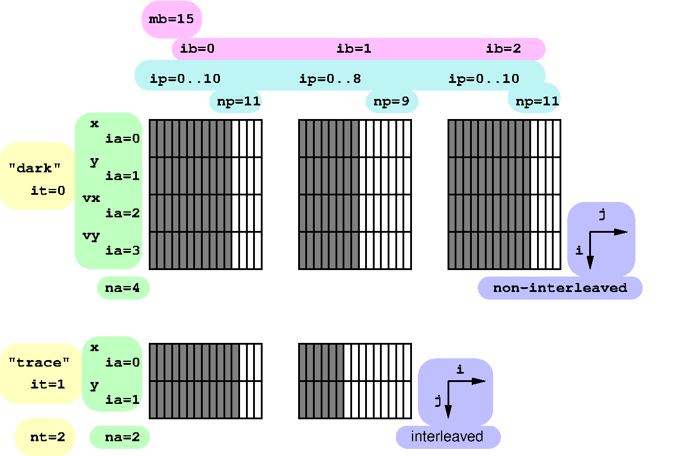

.. include:: ../roles.incl

****************
Particles Design
****************
.. toctree::

============
Requirements
============

======
Design
======

Particles are organized into `types`, where each type is defined using
some number of `attributes`, and particle attributes are stored in
some number of arrays called `batches`.

**Types**. Cello supports multiple different particle `types`. Some
types used in Enzo-E include ``"dark"`` for dark-matter particles, and
``"trace"`` for tracer particles. Particle types are identified using
an integer index, and by convention are stored in variables named
e.g. ``it`` (when operating on a single type, or looping over multiple
types), ``it_dark``, ``it_trace``, etc.; the total number of types is
stored as ``nt``. Types are indicated in yellow in the above figure.

**Attributes**. Each particle type can have one or more particle
`attributes`. All particles must have at least have attributes to
represent the position of a particle, such as ``x``, ``y``, and
``z``. Other attributes, such as mass, velocity, etc., are
optional. Particle attributes have user-defined types, which can be
integer or floating-point values. Attributes are indentified using an
integer index, and by convention are stored in variables named
e.g. ``ia_y`` (y-component of position), ``ia_mass``, ``ia_density``,
``ia_vz`` (z-component of velocity), etc.; the number of attributes is
stored as ``np``, ``np_dark``, or ``np_trace``. Attributes are
indicated in green in the above figure.

**Batches**. Particle attributes are stored in arrays called
`batches`, which span some fixed number of particles of a given type,
and all attributes.  By default, the 'attribute' array axis varies
fastest, but can be overridden so that the 'particle' array axis
varies fastest, in which case the particles are said to be
`interleaved`.  By convention batches are indexed using variables
``ib``, ``ib_dark``, ``ib_trace``, etc., and particles `within a
batch` are indexed using variables ``ip``, ``ip_dark``, ``ip_trace``,
etc., and the number of particles in the current batch as ``np``,
``np_dark``, or ``np_trace``. In the above figure, batch arrays are
represeted in gray, batch indices in magenta, and particle indices in
cyan. Batch array interelaving is represented in blue, where 'i'
represents the fastest-varying axis.

Interfaces
==========

-------------------
ParticleDescr class
-------------------

------------------
ParticleData class
------------------

--------------
Particle class
--------------

